# Análisis del proyecto: Pilas y Colas 2.0

## Alcance

El proyecto implementa once casos independientes sobre estructuras lineales. `Main` funciona como despachador: muestra un menú y llama al método `main` del ejercicio seleccionado. Los casos de **pilas** resuelven problemas donde se debe recuperar el último elemento insertado; los de **colas** procesan elementos en orden de llegada, salvo el caso del cine, que aplica prioridad entre dos filas.

## Diagrama UML de clases

El siguiente diagrama usa sintaxis Mermaid. Las clases `Nodo`, `Cliente`, `Consola`, `Solicitud`, `Mesa` y sus asignaciones son internas a la clase que las declara.

```mermaid
classDiagram
    class Main {
        +main(String[] args) void
        -mostrarMenu() void
        -leerOpcion(Scanner) int
        -ejecutar(int) void
    }

    class Pilas2 {
        +esPalindroma(String) boolean
        +main(String[] args) void
    }
    class Pilas4 {
        -leerRepisa(Scanner, String) Stack~Integer~
        +ordenarTomos(Stack~Integer~, Stack~Integer~) List~Integer~
        +main(String[] args) void
    }
    class Pilas5 {
        -prioridad(char) int
        -esOperador(char) boolean
        +aPostfija(String) String
        +main(String[] args) void
    }
    class Pilas7 {
        -crearPila(String) Stack~Integer~
        +sumar(String, String) String
        +restar(String, String) String
        +main(String[] args) void
    }
    class Pilas10 {
        +editarLinea(String) String
        +main(String[] args) void
    }

    class Colas1~T~ {
        -Nodo~T~ primero
        -Nodo~T~ ultimo
        -int tamano
        +agregar(T) void
        +eliminar() T
        +alReves() Colas1~T~
        +concatenar(Colas1~T~) void
        +intercalar(Colas1~E~, Colas1~E~) Colas1~E~
    }
    class NodoColas1~E~ {
        E dato
        Nodo~E~ siguiente
    }
    class Colas4~T~ {
        -Nodo~T~ primeroOcupado
        -Nodo~T~ primeroDisponible
        -int tamano
        +agregar(T) void
        +tomar() T
        +eliminar() T
        +vaciar() void
    }
    class NodoColas4~E~ {
        E dato
        Nodo~E~ siguiente
    }
    class Colas6~T~ {
        -ArrayDeque~T~ datos
        +agregar(T) void
        +agregarPrimero(T) void
        +eliminar() T
        +eliminarUltimo() T
    }
    class Colas7 {
        -ArrayDeque~Cliente~ asiduos
        -ArrayDeque~Cliente~ ocasionales
        +agregar(String, boolean) void
        +tomar() Cliente
        +eliminar() Cliente
    }
    class Cliente {
        String nombre
        boolean asiduo
    }
    class Colas8 {
        +asignar(ArrayDeque~Consola~, ArrayDeque~Solicitud~) List~Asignacion~
        +main(String[] args) void
    }
    class Consola {
        String codigo
        String descripcion
    }
    class Solicitud {
        String tienda
        int cantidad
    }
    class AsignacionConsola {
        String tienda
        List~String~ codigos
    }
    class Colas9 {
        +asignar(ArrayDeque~Mesa~, ArrayDeque~Reservacion~, boolean) List~Asignacion~
        +main(String[] args) void
    }
    class Mesa {
        String codigo
        int capacidad
    }
    class Reservacion {
        String nombre
        int comensales
    }
    class AsignacionMesa {
        String nombre
        String mesa
    }

    Main ..> Pilas2
    Main ..> Pilas4
    Main ..> Pilas5
    Main ..> Pilas7
    Main ..> Pilas10
    Main ..> Colas1
    Main ..> Colas4
    Main ..> Colas6
    Main ..> Colas7
    Main ..> Colas8
    Main ..> Colas9
    Colas1 *-- NodoColas1
    Colas4 *-- NodoColas4
    Colas7 *-- Cliente
    Colas8 ..> Consola
    Colas8 ..> Solicitud
    Colas8 ..> AsignacionConsola
    Colas9 ..> Mesa
    Colas9 ..> Reservacion
    Colas9 ..> AsignacionMesa
```

## Análisis por caso

| Caso | Problema y estrategia | Tiempo | Espacio auxiliar |
|---|---|---:|---:|
| `Pilas2` | Limpia la frase, apila todos los caracteres y compara la cadena normalizada contra los caracteres desapilados. Así comprueba si la secuencia se lee igual en ambos sentidos. | `O(n)` | `O(n)` |
| `Pilas4` | Trata cada repisa como pila, extrae sus tomos, los reúne en una lista y la ordena para formar la tercera repisa. La inserción inicial conserva correctamente cuál tomo está arriba. | `O(n log n)` | `O(n)` |
| `Pilas5` | Implementa el algoritmo de conversión infija a postfija: emite operandos, apila operadores y desapila según prioridad, asociatividad y paréntesis. | `O(n)` | `O(n)` |
| `Pilas7` | Apila los dígitos de los números para operar desde las unidades. Usa acarreo para sumar y préstamo para restar; puede devolver un resultado negativo. | `O(n)` | `O(n)` |
| `Pilas10` | Conserva los caracteres escritos en una pila. `-` retira el último, mientras que `$` y `%` limpian el contenido acumulado. | `O(n)` | `O(n)` |
| `Colas1` | Cola enlazada FIFO. Mantiene referencias a primero y último; agrega al final y elimina al frente. Incluye inversión con pila, concatenación e intercalado de dos colas. | Operaciones básicas: `O(1)`; invertir/concatenar/intercalar: `O(n)` | Básicas: `O(1)`; invertir/intercalar: `O(n)` |
| `Colas4` | Cola circular enlazada que separa nodos ocupados y disponibles. Un nodo eliminado se recicla para una inserción posterior, en vez de desecharse. | `agregar`/`eliminar`: `O(n)` por localizar el último nodo | `O(1)` adicional; `O(n)` almacenado entre ambos anillos |
| `Colas6` | Bicola respaldada por `ArrayDeque`. Permite agregar, consultar y eliminar desde cualquiera de los dos extremos. | Operaciones de extremo: `O(1)` amortizado | `O(1)` adicional |
| `Colas7` | Mantiene una cola FIFO de asiduos y otra de ocasionales. Al atender, prioriza la primera sin alterar el orden de llegada dentro de cada grupo. | `O(1)` por operación | `O(1)` adicional |
| `Colas8` | Procesa solicitudes en orden y entrega consolas desde el frente del inventario hasta satisfacerlas o agotarlo. Conserva el resultado por tienda. | `O(c + s)` | `O(c + s)` para asignaciones y datos de entrada |
| `Colas9` | Atiende reservaciones FIFO. Puede escoger la primera mesa apta o la de menor capacidad suficiente para optimizar ocupación. | `O(r × m)` en el peor caso | `O(r)` para resultados |

**Convenciones:** `n` es el número de caracteres, dígitos o elementos procesados; `c` representa consolas, `s` solicitudes, `r` reservaciones y `m` mesas disponibles.

## Decisiones de diseño relevantes

- Los ejercicios son clases independientes, lo cual permite ejecutarlos por separado o desde `Main`.
- `Stack` se utiliza cuando el problema exige invertir el orden de procesamiento.
- `ArrayDeque` sustituye una implementación manual cuando se necesita una cola o bicola eficiente de la biblioteca estándar.
- `Colas1` y `Colas4` muestran implementaciones enlazadas para practicar la gestión explícita de nodos.
- Las clases de asignación (`Colas8` y `Colas9`) consumen las colas recibidas: los inventarios, solicitudes, mesas y reservaciones cambian durante el proceso.
